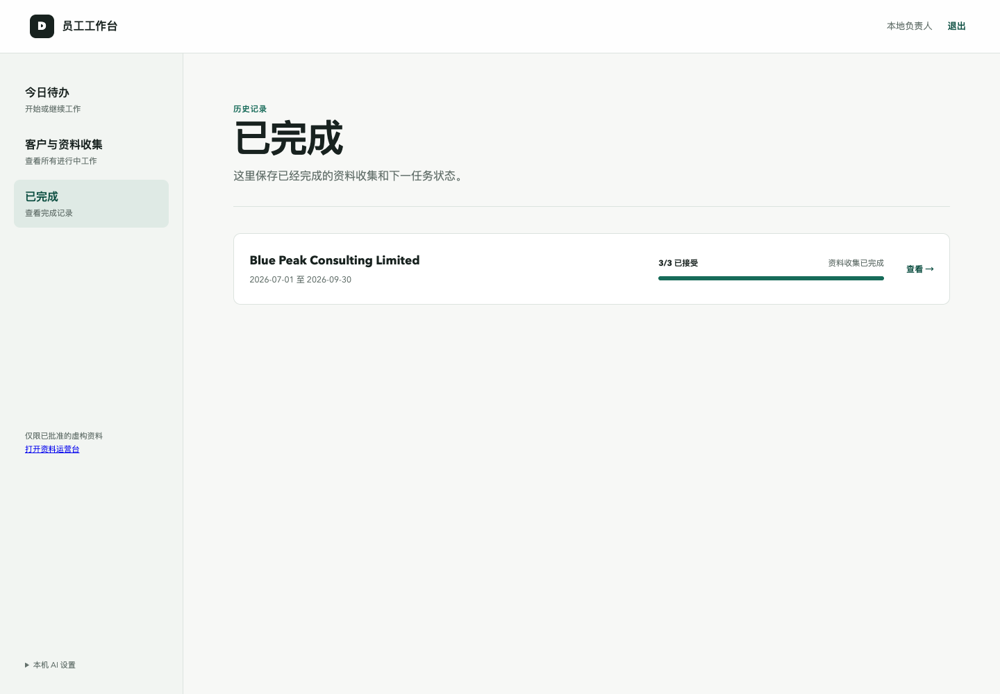
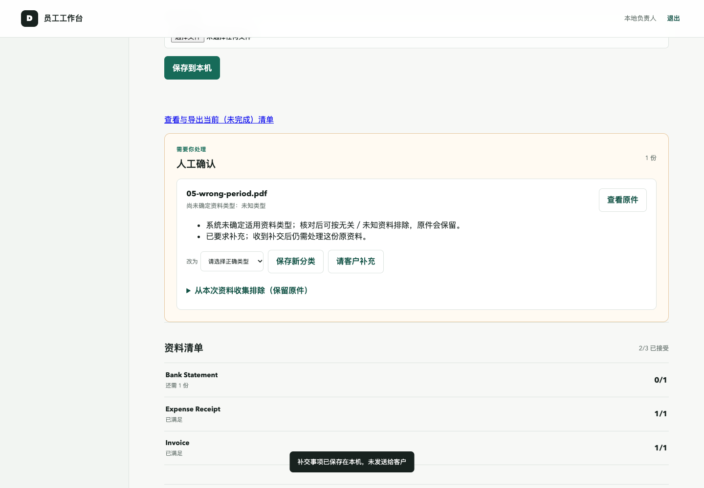
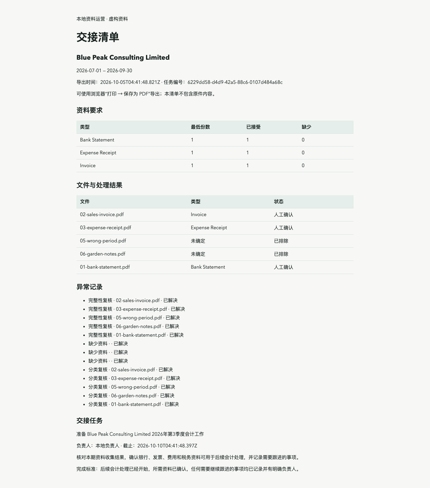

# Document Operations · 本地资料工作台

把散落的会计文件整理成一份可复核、可追踪、可交接的资料清单。

面向需要收集客户资料的小型会计团队，也适合想研究“文件上传 → AI 辅助 → 人工处理 → 工作交接”的开发者。它管理的是**资料收集和交接流程**，不代替会计判断，不自动记账或报税。

**[macOS 安装](platform/LOCAL_README.md) · [跟做一个完整示例](platform/EXAMPLE_WALKTHROUGH.md) · [版本下载](https://github.com/RookieAlden/document-operations-local/releases) · [验证与限制](docs/current/LOCAL_FINAL_ACCEPTANCE.md)**

## 一次资料任务如何完成

新建客户和季度资料任务 → 设定资料要求 → 上传并预览原件 → 人工分类或主动调用真实 AI → 复核、改类、处理缺件和补交 → 完成资料收集及后续任务 → 在历史中查看并导出交接清单。

缺少必需资料、有待复核文件或未关闭的补交问题时，不能完成交接。排除错期间或无关文件会保留原件；重复交接不会创建重复任务。

## 实际界面

以下截图来自当前版本、全新本地数据库中的虚构示例，使用免费人工路径；没有模拟 AI 返回结果。

### 员工工作台：查看客户任务与完成历史

### 人工复核：保留原件，处理错期间与缺件

### 完成交接：得到可打印的清单

## 可以做什么

- **客户与任务**：新建客户、月度或季度资料任务，自定需要的资料类型和数量；今日待办、进行中、已完成历史。
- **原件与复核**：保存和预览 PDF、PNG、JPEG；人工分类、改类、排除及恢复复核。
- **真实 AI（可选）**：按文件主动分类；不确定或期间冲突转人工处理。无密钥、失败或额度耗尽时仍可手工完成流程。
- **异常与交接**：记录补交问题、上传补充资料、关闭问题；完成资料收集、推进后续任务、导出清单（浏览器打印为 PDF）。
- **资料运营台**：查看任务、Case、复核与问题；与员工台共享本地登录。
- **持久化**：程序重启后保留文件和记录；登录配置独立保存，支持停机备份和后续更新。

## 本地运行与付费边界

业务程序、PostgreSQL 数据库、原件和个人配置在你的电脑上，服务仅监听本机地址。**真实 AI 分类仍通过外部 OpenAI API**：主动分类会把选中的文件及分类上下文发给提供商，并产生 API 费用。首次安装默认关闭 AI；上传、预览、人工处理、交接和导出均不需要 API 密钥或付费云服务。

本地版不包含客户远程提交、自动邮件催收、多人权限系统或公网部署。相关云适配代码仍保留在源码中，但本地启动器不启用它们。这个版本不是会计、税务或合规正确性认证，也没有实测净省时或商业收益结论。

## 开始体验

1. 按 [macOS 安装说明](platform/LOCAL_README.md)设置自己的登录账号并启动。
2. 打开 [完整示例](platform/EXAMPLE_WALKTHROUGH.md)，使用仓库自带的 [六份虚构 PDF](output/pdf/local-closeout)，无需生成文件或配置 AI。
3. 走完流程后，从已完成任务打开交接清单并打印保存 PDF。

## 验证与继续开发

类型检查、406 项单元及接口测试通过；已有 12 项本地浏览器流程检查。本次发布另按公开示例复核安装、人工补交、导出、重启、备份和更新。历史六份真实 AI 集成样本已验证，本次未新增付费调用。范围和实际环境见 [验证记录](docs/current/LOCAL_FINAL_ACCEPTANCE.md)。

当前只实测 macOS 同一台电脑上的独立安装；未在新电脑、Windows 或 Linux 上验证完整应用。GitHub 自动检查只运行类型检查与单元测试，不代表跨平台安装验收。

代码入口：`platform/service/src`；界面：`platform/service/public`；数据库：`platform/database`。使用 [MIT 许可证](LICENSE)，欢迎在本地修改后运行检查。录屏提纲见 [3—5 分钟演示](platform/DEMO_SCRIPT.md)。
